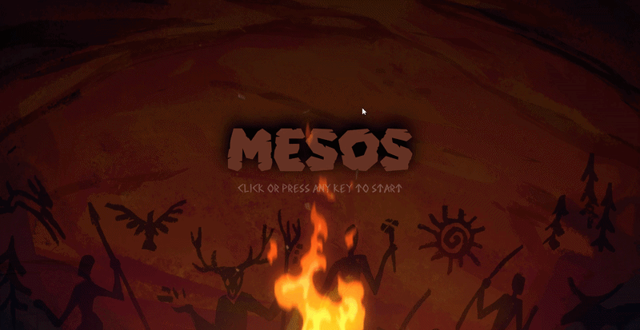
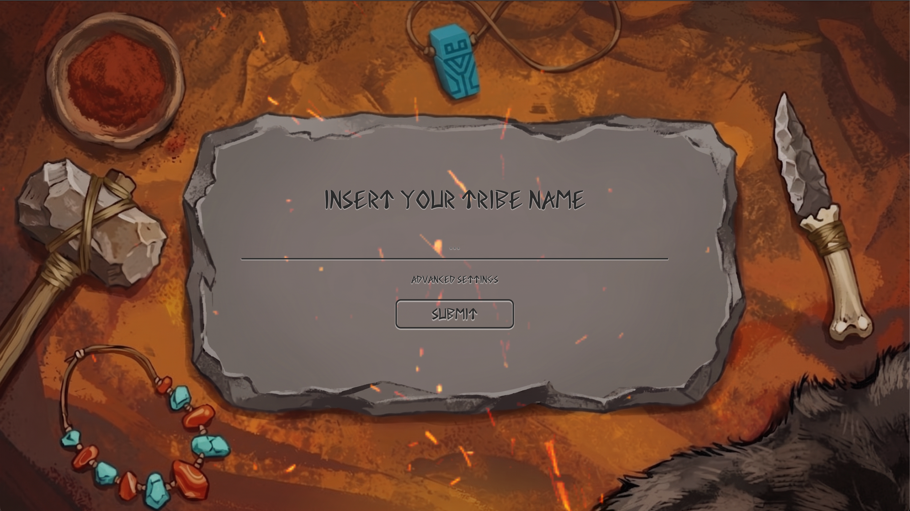
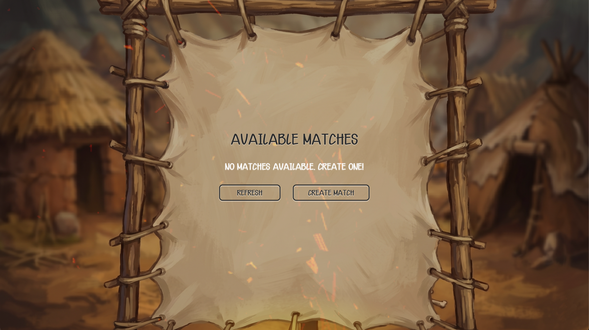
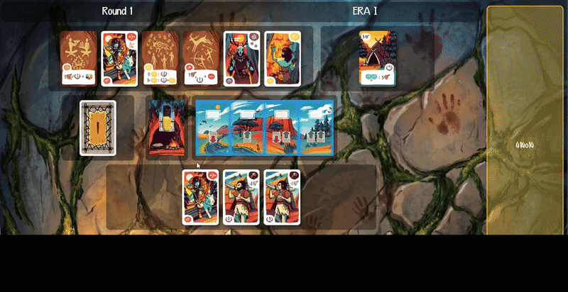
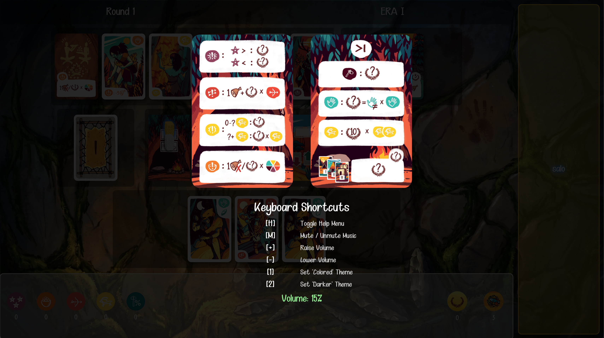
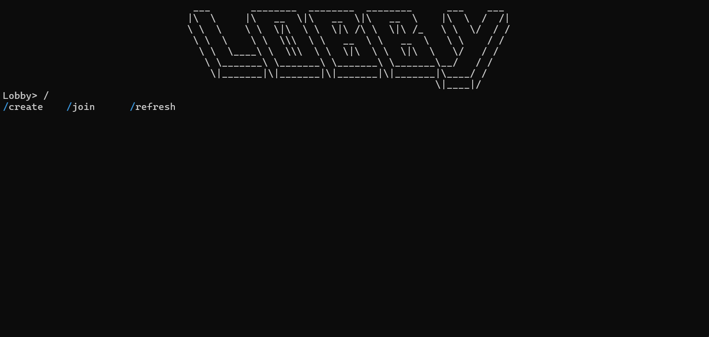
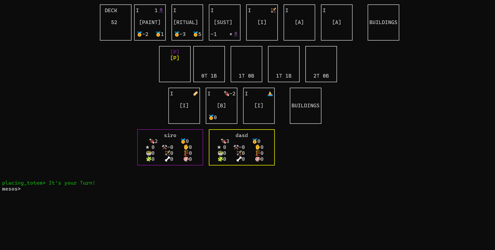
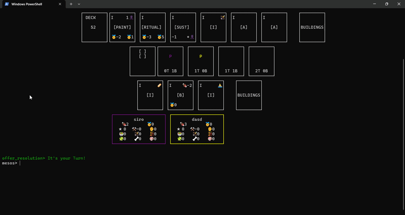
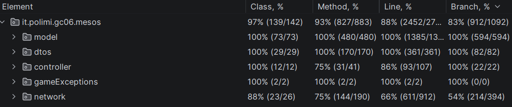
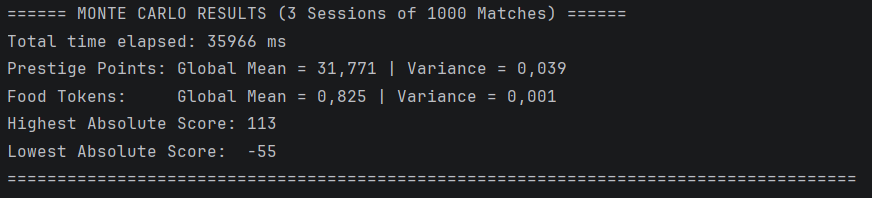

# Mesos - Software Engineering Final Project 2026 - GC06

<div align="center">
  
</div>
<div align="center">
  
  
</div>

<br>

<div>
  

This repository contains a full digital adaptation of the board game **Mesos**, developed entirely in Java using Maven
and JavaFX. The project implements a robust Client-Server architecture allowing multiple players to connect and play
together over a network.

<br>

The codebase has been designed from scratch following strict **SOLID** principles, clean code guidelines, and
*OOP/Functional* paradigms. The structural backbone of the application relies on the **MVC (Model-View-Controller)**
architectural pattern, enriched with standard GoF design patterns (Factory Method, Observer, State, Command, etc.) to
ensure high cohesion and low coupling.

</div>

# Implemented Features

| Feature              | Status | Description                                                                                                                           |
|:---------------------|:------:|:--------------------------------------------------------------------------------------------------------------------------------------|
| **Basic Rules**      |   🟢   | Complete implementation of the official Mesos board game rules.                                                                       |
| **CLI / TUI**        |   🟢   | Command Line Interface leveraging ANSI escape codes and UTF-8 for a clean terminal experience.                                        |
| **GUI**              |   🟢   | Graphical User Interface built with JavaFX, featuring dynamic animations and responsive layouts.                                      |
| **TCP + RMI**        |   🟢   | Full TCP Socket and RMI implementation for client-server communication, allowing clients with different technologies to play together |
| **Multiple Matches** |   🟢   | Server capable of handling multiple distinct matches and lobbies concurrently.                                                        |
| **Persistence**      |   🟢   | Server-side persistance on crashes, allowing players to restart from where they had left                                              |
| **Database**         |   🟢   | Seamless database integration for a full leaderboard of the matches                                                                   |

---

# How to Build

Ensure you have **Java 25+** and **Maven** installed on your machine. To compile the project and build the executable
JAR files, navigate to the root directory of the repository and run:

```bash
mvnw clean package
```

The compiled .jar files will be generated inside the target/ directory, ```cd``` into it and run the .jar files as
described in the next section.

```bash
cd target/
```

> [!CAUTION]
> You might need to add execution privileges for mvnw on Unix-based systems using
> ```chmod +x mvnw```

---

# Server configuration

Run the .jar file for the server with the following command:

```bash
java -jar mesos-1.0-server.jar
```

> [!TIP]
> To host a multiplayer session across different external networks (WAN), we recommend utilizing Virtual LAN solutions
> such as [ZeroTier](https://www.zerotier.com/), [Hamachi](https://vpn.net/),
> or [Wireguard](https://www.wireguard.com/).
> Alternatively, advanced users can manually configure the appropriate port forwarding rules on the host server's
> router.
>
> Remember to launch the jar with the command:
> ```bash
> java --ip=SERVER_PUBLIC_IP_ADDRESS -jar mesos-1.0-server.jar
> ```

> [!CAUTION]
> You might need to add execution privileges for the .jar file on Unix-based systems using
> ```chmod +x mesos-1.0-server.jar```

## Available arguments

| Argument      | Description                                                                   |
|:--------------|:------------------------------------------------------------------------------|
| `--ip`        | Specifies the IP address to bind the server to.                               |
| `--dname`     | Specifies the name of the database to connect to.                             |
| `--dloc`      | Specifies the location of the database.                                       |
| `--duser`     | Specifies the database user credentials in the format `username:password   `. |
| `--tcp`       | Specifies the TCP port number for client connections (default: 45161).        |
| `--rmi`       | Specifies the RMI port number for client connections (default: 1099).         |
| `--rmiexport` | Specifies the RMI export port number for client connections (default: 1100).  |

---

# Client configuration

Run the .jar inside your own operating systems' **Command Prompt** for the client with the following command

```bash
java -jar mesos-1.0-client.jar
 ```

Follow the instructions that appear on the screen to start a game (make sure to enter the correct Server IP).


> [!TIP]
> When connecting to a remote server over the internet—whether through a Virtual LAN (such
> as [ZeroTier](https://www.zerotier.com/), [Wireguard](https://www.wireguard.com/), or [Hamachi](https://vpn.net/)) or
> via a direct WAN connection, the client must correctly broadcast its IP address to receive server callbacks.
>
> If you choose to play via RMI over these external networks, you must launch the client application by explicitly
> defining your routing IP (your Virtual LAN IP or your Public IP, depending on your setup) using the following JVM
> argument, or select the correct IP address when starting the client:
> ```bash
> java --ip=YOUR_PUBLIC_IP_ADDRESS -jar mesos-1.0-client.jar
> ```

> [!CAUTION]
> You might need to add execution privileges for the .jar file on Unix-based systems using
> ```chmod +x mesos-1.0-client.jar```

## Available arguments

| Argument | Description                                               |
|:---------|:----------------------------------------------------------|
| `--gui`  | Starts the game in GUI mode                               |
| `--cli`  | Starts the game in CLI mode                               |
| `--port` | Specifies the RMI export port number for server callbacks |

---

# Gameplay features

## GUI

The GUI features a dynamic and visually appealing interface, complete with animations and sound effects for player
actions, phase
transitions and game events. The interface is designed to be intuitive, providing players with
a seamless gaming
experience.

It also features a help menu, showing custom keyboard shortcuts.







## TUI

The TUI (Text-based User Interface) is designed for players who prefer a terminal-based experience. It utilizes ANSI
escape codes and UTF-8 characters to create a visually structured and interactive interface. The TUI provides clear
prompts and feedback, ensuring that players can easily navigate through the game phases and actions.

It also features complete and dynamic completions for all the available commands (with `tab` completion), making it
easier
for players to
interact with the game without needing to remember all the command syntax.





## Available Commands (TUI)

| Command                            | Description                                  |
|:-----------------------------------|:---------------------------------------------|
| `/pick_card <top/bottom> <id>`     | Picks a card from the specified position     |
| `/pick_building <top/bottom> <id>` | Picks a building from the specified position |
| `/place_totem <tile>`              | Places a totem on the specified tile         |
| `/skip`                            | Skips your turn                              |
| `/help`                            | Displays help information                    |
| `/clear`                           | Clears the terminal                          |
| `/buildings`                       | Displays available buildings                 |
| `/board <player>`                  | Displays the specified player's board        |

---

# Testing




### Monte Carlo Simulation (Stress Testing & Game Balancing)

This project includes a dedicated `MonteCarloSimulationTest` designed to run thousands of automated, fully simulated
matches. During the simulation, algorithmic "bots" perform randomized, rule-compliant actions from the beginning to the
end of a match.

This tool serves two critical purposes in the development lifecycle:

* **Engine Stress Testing:** By pushing the `TurnManager` and the core game logic to their limits with unpredictable
  action sequences, the test ensures the state machine never encounters soft-locks, infinite loops, or unexpected
  crashes during complex phase transitions.
* **Game Economy & Balancing:** The simulation aggregates end-game statistics across multiple sessions—calculating the
  global mean and variance for Prestige Points and Food Tokens, alongside absolute highest and lowest scores. This
  provides empirical data to evaluate and fine-tune the game's economy and design.

**Configuration:**
The simulation is highly modular. By default, it is configured to run 3 sessions of 1,000 matches. You can adjust the
`SESSIONS`, `ITERATIONS_PER_SESSION`, and `VERBOSE` constants directly within the test class to run quicker checks or
more extensive data gathering.



---

# Group GC06

| Studente              | Email                                                                       | GitHub                             |
 |:----------------------|:----------------------------------------------------------------------------|:-----------------------------------|
| **Manuel Ricciardi**  | [manuel.ricciardi@mail.polimi.it](mailto:manuel.ricciardi@mail.polimi.it)   | https://github.com/manuel2487      |
| **Tommaso Salomoni**  | [tommaso.salomoni@mail.polimi.it](mailto:tommaso.salomoni@mail.polimi.it)   | https://github.com/salotom         |
| **Filippo Sciorelli** | [filippo.sciorelli@mail.polimi.it](mailto:filippo.sciorelli@mail.polimi.it) | https://github.com/fsciorelli      |
| **Riccardo Sironi**   | [riccardo1.sironi@mail.polimi.it](mailto:riccardo1.sironi@mail.polimi.it)   | https://github.com/Riccardo-Sironi |
